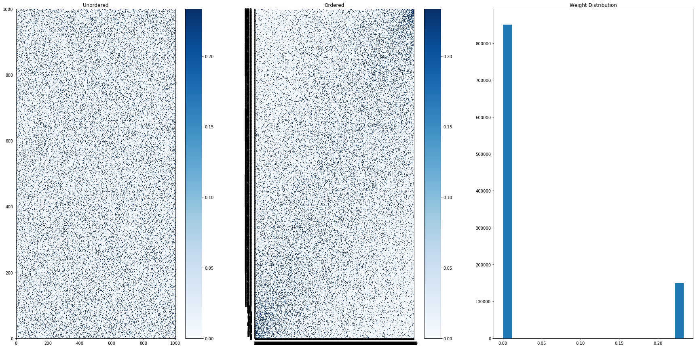
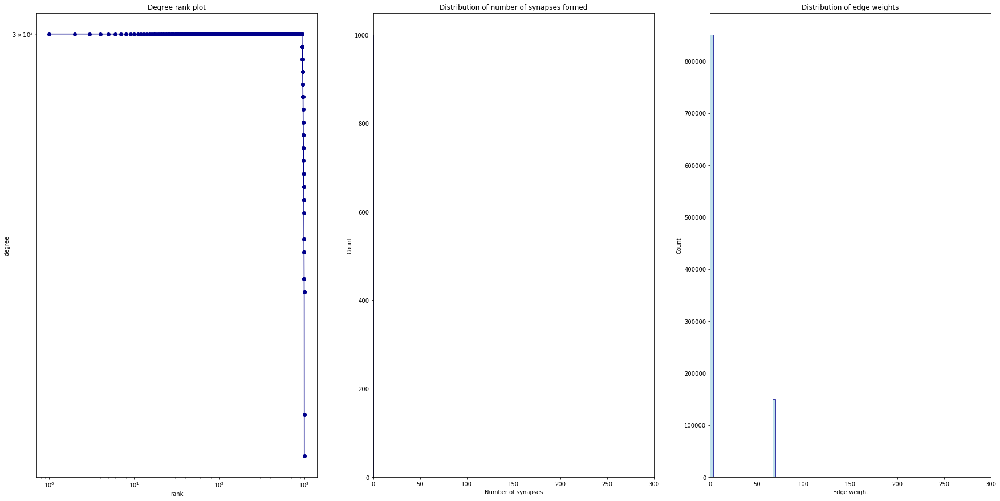

# Individual based model of network of neurons.

## Agent-based model

Neurons are self excited (due to noise). For some network configurations, we have synchronization, see [HERE](https://github.com/sahandha/NeuroNet/blob/master/NeuronModel/Demo-Copy2.ipynb). When the network is too weak, no synchronization happens, see [HERE](https://github.com/sahandha/NeuroNet/blob/master/NeuronModel/Demo-Copy3.ipynb).

--------------------------------------------------------------------------------

We build a network of neurons that can form synapses over time. When a single neuron is excited, through the connections formed, all the other neurons are excited as well. See the file [demo.ipynb](https://github.com/sahandha/NeuroNet/blob/master/examples/demo.ipynb) in the examples folder for a sample simulation.

## Vectorized Simulation

Simulating the system using Agent-based modeling approach is computationally expensive. So for large networks we use a vectorized form of the simulation. The code is maintained in <./NeuronModel>. Please see some example notebooks therein.

Some preliminary results:

### Sample ensemble firing patterns

  

### Sample network connectivity matrix
