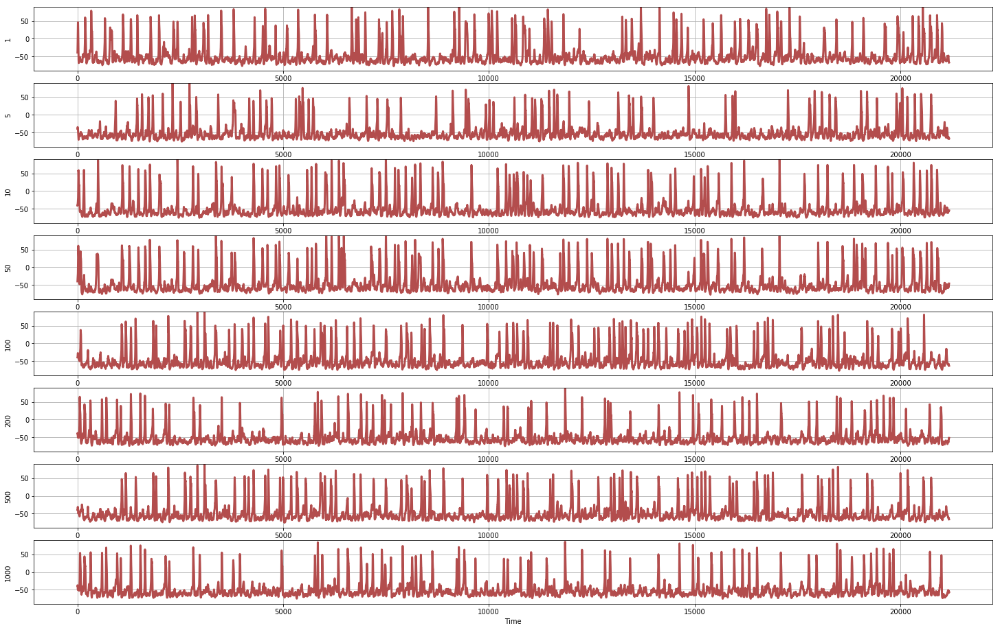
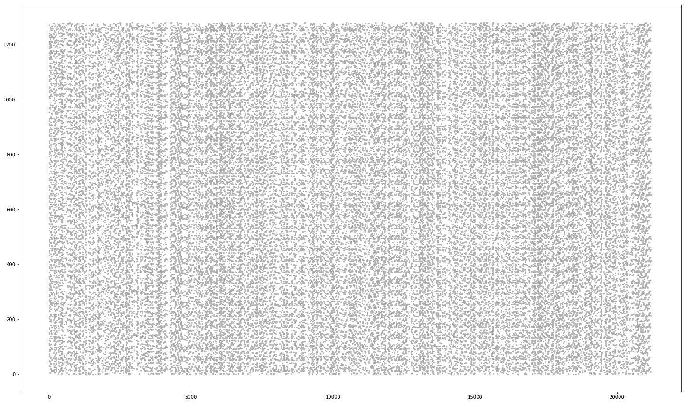

# Individual Based Network of Neurons (Parallelized using MPI)

All the code relevant to parallelization is maintained in [./NeuronModel](https://github.com/sahandha/NeuroNet/tree/BW_MPI/NeuronModel)

Here we run long term simulations. Some of the preliminary results are as follows:

#### Individual Neuron Spikes

#### Ensemble Firing Patterns

#### Adjacency Matrix

